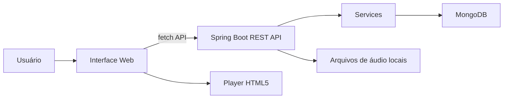

# 🎧 PlayMySongs

<p align="left">
  
  
  
  
  
  
  
  
</p>

O **PlayMySongs** é uma aplicação web desenvolvida com **Spring Boot** para cadastro, busca e reprodução de músicas.

O projeto permite enviar arquivos de áudio, registrar informações como nome da música, artista e estilo musical, armazenar os dados no **MongoDB** e pesquisar faixas por palavra-chave.

## 🎯 Objetivo

A proposta do projeto é criar um sistema simples para gerenciamento de músicas, unindo backend em Java com uma interface web estática.

Ele foi desenvolvido como projeto acadêmico, mas organizado como um repositório de portfólio para demonstrar conhecimentos em:

- desenvolvimento backend com Spring Boot;
- criação de APIs REST;
- integração com MongoDB;
- upload de arquivos;
- manipulação de dados no frontend com JavaScript;
- consumo de endpoints via `fetch`.

## ⚙️ Funcionalidades

- Cadastro de músicas com nome, artista, estilo e arquivo de áudio.
- Upload de arquivos `.mp3` ou `.ogg`.
- Armazenamento dos metadados no MongoDB.
- Busca de músicas por nome, artista, estilo ou arquivo.
- Reprodução das músicas cadastradas no navegador.
- Listagem dinâmica de estilos musicais.
- Sugestão aleatória de música na página inicial.
- Interface web responsiva com HTML, CSS e JavaScript.

## 🧰 Tecnologias Utilizadas

- **Java**
- **Spring Boot**
- **Spring Web MVC**
- **MongoDB**
- **Gson**
- **HTML5**
- **CSS3**
- **JavaScript**
- **Maven**

## 🏗️ Arquitetura



## 📁 Estrutura do Projeto

```text
src/
  main/
    java/
      unoeste/fipp/projetofciii/
        entities/
        restcontrollers/
        services/
        ProjetoFciiiApplication.java
    resources/
      static/
        css/
        js/
        musicas/
        index.html
        cadastroMusica.html
        pesquisa.html
      application.properties
```

## 🚀 Como Executar

Antes de iniciar a aplicação, tenha o **MongoDB** rodando localmente na porta padrão:

```text
mongodb://localhost:27017
```

Depois, execute o projeto com Maven:

```powershell
.\mvnw.cmd spring-boot:run
```

Acesse no navegador:

```text
http://localhost:8080
```

## 🔌 Principais Endpoints

### Teste da API

```http
GET /apis/test
```

### Cadastro de música

```http
POST /apis/music-upload
```

Campos esperados no formulário:

```text
nomeMusica
nomeAutor
estilo
file
```

### Pesquisa de músicas

```http
GET /apis/find-musics?keyword=termo
```

### Listagem de estilos

```http
GET /apis/get-music-styles
```

### Música em destaque

```http
GET /apis/random-music
```

## 🗄️ Banco de Dados

O projeto utiliza o banco:

```text
my_musics
```

Collections utilizadas:

```text
musics
estilos
```

Exemplo de documento em `musics`:

```json
{
  "nomeMusica": "Hear Me Now",
  "nomeAutor": "Alok",
  "estilo": "Pop",
  "arquivo": "hearmenow_alokezeeba_pop.mp3"
}
```

## 🎵 Observação Sobre Arquivos de Música

Os arquivos de áudio enviados pela aplicação ficam na pasta:

```text
src/main/resources/static/musicas/
```

Essa pasta é ignorada pelo Git para evitar versionar músicas, arquivos pesados ou conteúdos com direitos autorais. O repositório mantém apenas um `.gitkeep` para preservar a estrutura da pasta.

## 📌 Status do Projeto

Projeto acadêmico funcional, com backend, frontend estático e integração com MongoDB.
